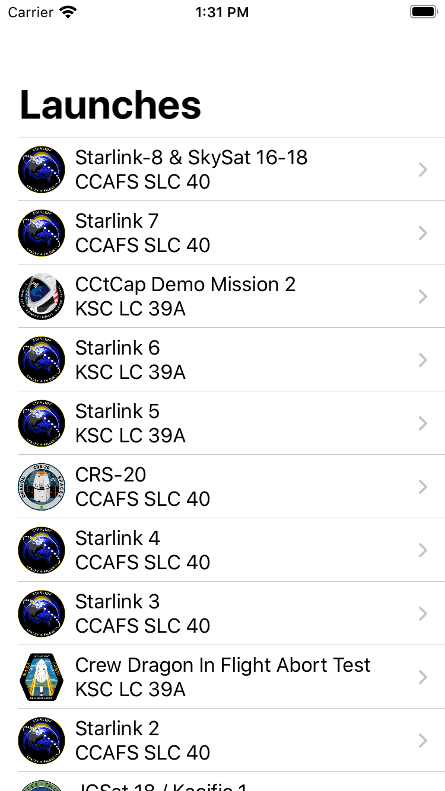

# RocketReserver

This is SwiftUI version of Apollo GraphQL example which is available on Appollo Official Website ( https://www.apollographql.com/docs/ios/ )

## Introduction

You can get informations of SpaceX launches and even reserve it!

  

## Platform

above iOS version 13 (due to SwiftUI)

## Tech Stacks

- Swift UI
- Combine

Following libraries are installed on Swift Package Manager

- Apollo iOS Client
- SDWebImageSwiftUI
- KeychainSwift